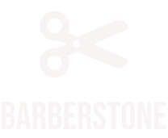

    

## Índice

1. [Sobre](#Sobre)
2. [Objetivo](#Objetivo)
3. [Tecnologias e ferramentas](#Tecnologias-e-ferramentas)
4. [Projeto](#Projeto)
5. [Desenvolvimento](#Desenvolvimento)

# Sobre

Após uma pesquisa sobre os serviços prestados por barbearias este projeto foi desenvolvido pensando em como poderíamos aperfeiçoar os atendimentos de barbearias, tanto para clientes como para barbeiros e empresários.

  

# Objetivo

Nosso objetivo desde o princípio foi criar uma solução viável para os usuários de barbearias e também para barbeiros que tem encontrado dificuldades para gerir as demandas de seus estabelecimentos.

  

# Tecnologias e ferramentas

Este projeto foi desenvolvido principalmente com React JS. Estas são todas as bibliotecas que utilizamos:

## Componentes e estilos

Material-UI
Styled-components
Framer Motion
React Card Flip
React Multi Carousel
React Scroll
React Toastify

## Rotas e API

React Router DOM
Axios
Jwt-decode

## Formulários

React Hook Form
Yup

## Testes

Cypress
Jest

  

# Projeto

Estas são algumas demonstrações do projeto Barberstone:

<h2 align="center">Página Inicial</h2>

Apresentação da aplicação. Além das boas-vindas ao usuário, dá uma breve introdução de como ela pode lhe ajudar.

  

<h2 align="center">Perfil Cliente</h2>

O usuaŕio tem acesso aos seus últimos atendimentos e aos seus dados pessoais que podem ser importantes para o agendamento.

  

<h2 align="center">Perfil Barbearia</h2>

A barbearia por sua vez, controla todos os seus agendamentos, podendo finalizá-los e adicionar novos barbeiros que aparecerão como opção para o cliente.

  

<h2 align="center">Usuário acessando página da Barbearia</h2>

Quando o usuário acessa o perfil de uma barbearia ele tem acesso aos últimos agendamentos daquele estabelecimento, além das informações cadastradas pela própria barbearia afim de atrair a atenção dos seus clientes, como as opções de lazer.

  

## Figma

Aqui está o link para o figma do projeto Barberstone
[Figma Barberstone](https://www.figma.com/file/2Pa4xeue7LrQJ7cUypoTnl/Capstone?node-id=0%3A1)

  

# Desenvolvimento

Este projeto foi desenvolvido por:

## André Vieira - Quality Assurance

[LinkedIn](https://www.linkedin.com/in/andreluizhillerv/)
[Github](https://github.com/AndrelhVieira)

## Leonardo Perrella - Tech Lead

[LinkedIn](https://www.linkedin.com/in/leonardo-augusto-perrella/)
[Github](https://github.com/Leonardoperrella)

## Leandro Arruda - Scrum Master

[LinkedIn](https://www.linkedin.com/in/leandro-arruda-26b8b11b3/)
[Github](https://github.com/leandroNarruda)

  

    

